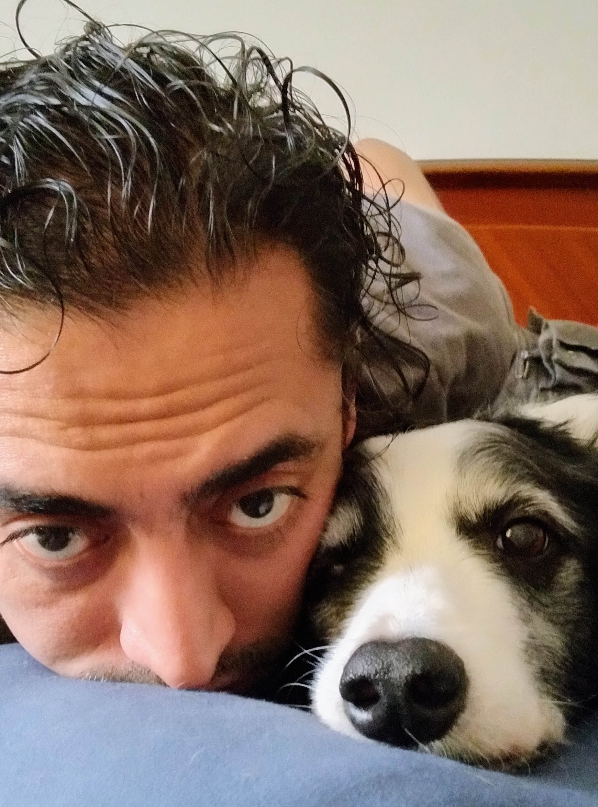

# Olfactory-stimulation-toolkit
 This repository contains the files related to the project Olfactory-stimulation-toolkit. It is based on Laura V. Cuaya and Raúl Hernández design of the project for NAPEmo.
 
- paradigm: MATLAB script that contains the files necessary to run the paradigm in the scanner.

- device: contains files related to the MR-compatible olfactory stimuli delivery device.

